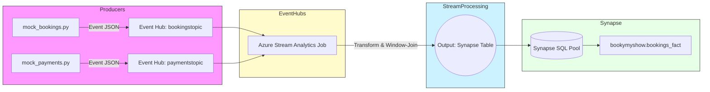

# 🎟️ BookMyShow Online Ticket Booking — Real-Time Stream Data Processing

A complete, **end-to-end streaming data pipeline** that simulates a BookMyShow-like ticketing flow using **Azure Event Hubs**, **Azure Stream Analytics**, and **Azure Synapse Analytics (DWH)**.
This repo contains mock producers for Bookings and Payments, a Stream Analytics query to transform & window-join data, and the Synapse DWH schema to persist the final fact table.

---

## 🚀 Highlights

* Simulates streaming booking & payment events with Python + `Faker`.
* Real-time transformations and array-unwinding of seats in **Stream Analytics**.
* Windowed join of Bookings ↔ Payments (matching `order_id`, time window).
* Writes final enriched records into **Synapse** (`bookymyshow.bookings_fact`) for analytics.

---

## 🏗️ Architecture (Mermaid)

Paste the following Mermaid block into your `README.md` (GitHub supports rendering Mermaid) — or view it on any Mermaid renderer.



---

## 📁 Repo Structure

```
📁 BookMyShow-Stream-Processing
 ┣ 📜 mock_bookings.py            # Booking event producer (Event Hub: bookingstopic)
 ┣ 📜 mock_payments.py            # Payment event producer (Event Hub: paymentstopic)
 ┣ 📜 stream_analytics_job_query.sql  # Stream Analytics transformation & join query
 ┣ 📜 synapse_create_table.sql        # Synapse schema creation SQL
 ┣ 📜 README.md
```

---

## 🛠️ Tech Stack

* Python (mock producers) 🐍
* Azure Event Hubs (ingest) ☁️
* Azure Stream Analytics (real-time processing) ⚡
* Azure Synapse Analytics (SQL DW) 🗄️
* SQL (schema & verification) 🧾

---

## ✅ What each file does

### `mock_bookings.py`

* Generates booking events with:

  * `order_id`, `booking_time`
  * `customer` object (id, name, email)
  * `event_details` (event\_id, event\_name, location, `seats` array)
* Sends JSON messages to `bookingstopic` Event Hub.

### `mock_payments.py`

* Generates payment events with:

  * `payment_id`, `order_id`, `payment_time`, `amount`, `payment_method`, `payment_status`
* Sends JSON messages to `paymentstopic` Event Hub.

### `stream_analytics_job_query.sql`

* Transforms the incoming JSON streams:

  * Unnests `seats` array (CROSS APPLY + `GetArrayElements`)
  * Converts times to datetime
  * Derives `event_category`, `payment_type`, booking `day` & `hour`
  * Performs a join between booking and payment streams on `order_id` with a time window
* Outputs to Synapse table `bookings-synapse` (configured as Stream Analytics output to Synapse).

### `synapse_create_table.sql`

* Creates schema `bookymyshow` and table `bookymyshow.bookings_fact` (final fact table schema).

---

## ⚙️ Setup & Run (Step-by-step)

### 1. Prerequisites

* Azure subscription with:

  * Event Hub namespace (create two Event Hubs: **bookingstopic**, **paymentstopic**)
  * Stream Analytics Job
  * Synapse Workspace with a dedicated SQL pool (or serverless SQL endpoint that Stream Analytics can write to)
* Python 3.8+ installed
* Install Python deps:

```bash
pip install azure-eventhub faker
```

---

### 2. Configure connection strings

Edit these files and replace placeholders with actual Event Hub connection strings:

* `mock_bookings.py` → `event_hub_connection_str` for `bookingstopic`
* `mock_payments.py` → `event_hub_connection_str` for `paymentstopic`

> Tip: Keep connection strings secret — use environment variables or an Azure Key Vault for production.

---

### 3. Start producers (locally)

Run both producers (in separate terminals):

```bash
python mock_bookings.py
python mock_payments.py
```

They will continuously publish events (every \~5 seconds as coded).

---

### 4. Configure Stream Analytics Job

* Inputs:

  * Input 1: Event Hub → `bookingstopic`
  * Input 2: Event Hub → `paymentstopic`
* Output:

  * Azure Synapse Analytics (provide workspace / SQL pool details)
* Query: use the provided `stream_analytics_job_query.sql`.

> Ensure the Stream Analytics job timezone and serialization format match the producers (JSON, UTC timestamps).

---

### 5. Create Synapse schema/table

Run `synapse_create_table.sql` against your Synapse SQL pool:

```sql
CREATE SCHEMA bookymyshow;

CREATE TABLE bookymyshow.bookings_fact (
    order_id NVARCHAR(50) NOT NULL,
    booking_time DATETIME2,
    customer_id NVARCHAR(50),
    customer_name NVARCHAR(100),
    customer_email NVARCHAR(100),
    event_id NVARCHAR(50),
    event_name NVARCHAR(100),
    event_location NVARCHAR(200),
    seat_number NVARCHAR(10),
    seat_price FLOAT,
    event_category NVARCHAR(50),
    booking_day_of_week NVARCHAR(20),
    booking_hour INT,
    payment_id NVARCHAR(50),
    payment_time DATETIME2,
    amount FLOAT,
    payment_method NVARCHAR(50),
    payment_type NVARCHAR(50),
    booking_event_time DATETIME2,
    payment_event_time DATETIME2
);
```

---

### 6. Verify data

After starting the producers and the Stream Analytics job, query Synapse:

```sql
SELECT TOP 100 * 
FROM bookymyshow.bookings_fact
ORDER BY booking_time DESC;
```

You should see enriched, joined booking + payment records.

---

## 🔎 Stream Analytics Query — Notes & Fixes

Your provided query is a great start. A couple of practical corrections/notes:

* Use `System.Timestamp` for event ingestion time fields in each transformed stream (already included).
* The JOIN condition should use `DATEDIFF(minute, b.booking_event_time, p.payment_event_time) BETWEEN 0 AND 2` (explicit timestamp columns), not `DATEDIFF(minute, b, p)`.
* Ensure `GetArrayElements(event_details.seats)` is referenced correctly — your query uses `seat.arrayvalue` which is the right pattern for array elements in Stream Analytics.

Here’s a corrected *JOIN* snippet (for clarity):

```sql
...
FROM TransformedBookingStream b
JOIN TransformedPaymentStream p
ON b.order_id = p.order_id
AND DATEDIFF(minute, b.booking_event_time, p.payment_event_time) BETWEEN 0 AND 2
```

---

## 📌 Example Record (what you’ll store)

```text
order_id: order_2001
booking_time: 2025-09-07 12:34:56
customer_id: cust2001
customer_name: Jane Doe
event_id: event27
event_name: Concert
seat_number: A5
seat_price: 85.0
event_category: Music
booking_day_of_week: Sunday
booking_hour: 12
payment_id: payment_3001
payment_time: 2025-09-07 12:35:10
amount: 160.0
payment_method: Credit Card
payment_type: Card
```

---

## ♻️ Useful Enhancements (ideas)

* ✅ Aggregations in Stream Analytics (e.g., revenue per event per 5-min window).
* ✅ Add **retries / dead-letter** handling for failed payment events.
* ✅ Integrate **Azure Functions** for enrichment (e.g., enrich event data from an external API).
* ✅ Add **Power BI** report/dashboard on Synapse for real-time insights.
* ✅ Add schema registry or AVRO/JSON schema validation for producers.
* ✅ Add trauma-testing / load testing: scale up producers and validate Stream Analytics job throughput.

---

## 🧾 Troubleshooting Tips

* If Stream Analytics fails to write to Synapse:

  * Confirm firewall rules & managed identity are configured.
  * Check SQL user permissions for Stream Analytics output.
  * Ensure output table exists and schema matches the output fields.
* If joins are missing results:

  * Check clock skew/timezones between producers — convert to UTC consistently.
  * Increase join window for debugging (e.g., 0–5 minutes) to capture late-arriving payments.

---

## 🧑‍💻 Contributing

Contributions are welcome!

* Fork → Create a branch → Add features/tests → Submit PR.
  Please keep code & secrets out of the repo (use `.env` or Azure Key Vault).

---

## ❤️ Author & License

Built with ❤️ using Azure data services.
